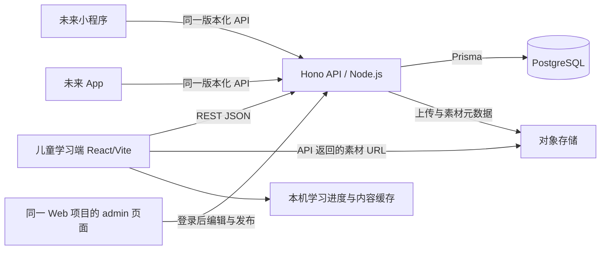

# LearnBuddy 前后端分离选型方案

日期：2026-09-21 ｜ 状态：Hono 与多客户端方向已确认；ARC-01 已通过开发验证，待手机体验

执行计划已整合到[开发计划](./开发计划.md)，采用推荐技术路线。本文保留设计与初步分项估算，实际顺序、剩余工期和状态以统一计划为准，不重复累计。

## 1. 结论与假设

推荐保留 **React + Vite + TypeScript** 学习端，增加 **Hono on Node.js REST API + Prisma + PostgreSQL + 对象存储**，并在同一 React/Vite 项目的 `/admin` 建设懒加载的内容管理后台。用户已补充每个账户保存进度与错题的需求，账号与学习数据模型纳入整体架构；先分阶段交付内容服务，再接通云端学习记录，方案见[账户与学习数据设计](./账户与学习数据设计.md)。现有本机记录导入时由家长指定孩子档案。

推荐依据是项目现有 TypeScript 技术栈，以及已经规划的课程版本、复习调度、学习证据与找字局面等业务。自建 API 的前期工作多于 CMS，但可用同一套业务层承载内容发布和后续学习服务。若目标收缩为“尽快让非开发人员编辑故事和素材”，优先选择下文的 Payload CMS 路线更合适。

部署假设：先服务现有家庭试用、兼顾国内手机访问，初期单实例即可。具体云厂商、预算、已有后端团队能力尚未确定；不据此购买资源或承诺公网访问性能。

## 2. 当前结构及真正需要拆分的部分

迁移前基线是 React 应用，内容主要在 TypeScript 与素材目录中；当前已拆分工作区并接入课程 API，下表记录原型来源与迁移目标：

| 当前位置 | 当前内容 | 迁移方向 |
| --- | --- | --- |
| `apps/web/src/main.tsx` | 路由、页面、活动推进、进度读写集中 | 拆为页面、学习流程、内容服务、进度服务；UI 继续由 React 渲染 |
| `apps/web/src/content.ts` | 主题、十课、三十字、词语、故事、课程步骤生成 | 业务内容及每课编排入 PostgreSQL，经 API 返回 |
| `apps/web/src/readingTimings.ts` | 音频关联文本及逐字时间点 | 作为音频内容版本的一部分入库 |
| `LessonPicture`、`StoryPicture`、`HiddenCharacters` | 插画 SVG、找字布局和提示部分写在组件内 | 故事／找字插画导出为资源，布局、提示、候选字配置入库；前端保留交互渲染器 |
| `apps/web/public/assets/audio` | 本地 WAV，约 8.6 MB | 迁入对象存储，数据库记录对象键、版本、时长等信息 |
| `apps/web/src/progress.ts` 与 localStorage | 学习规则与本机记录 | 第一阶段保留本机进度，改为基于 API 内容校验；账号同步作为独立阶段 |

把大组件拆成小组件解决代码维护；内容入库和 API 化解决内容管理。这两项需要一起做。界面按钮文字、布局样式、可执行交互逻辑仍属于前端代码，无需全部变成数据库记录。

## 3. 候选路线比较

下面的开发量、可维护性判断为针对本项目的工程评估，不是性能基准测试。

| 路线 | 内容管理能力 | 自定义学习逻辑 | 前期工作／长期代价 | 适用判断 |
| --- | --- | --- | --- | --- |
| A：Hono + Prisma + PostgreSQL | 需建设编辑、上传、预览、发布界面 | 自由度高，可按课程与学习业务划分模块 | 框架概念少；校验、错误处理及模块边界需统一约定 | **当前采用**，适合现阶段模块化单体 |
| B：Payload CMS + PostgreSQL | 提供管理后台与内容 API，内容模型用代码定义 | 可通过后端扩展实现，需遵循 CMS 约定 | 更快有编辑后台；后端引入其 Next.js 运行结构 | 内容生产效率优先时的首选替代；学习端可继续使用 Vite |
| C：Directus + PostgreSQL | 数据管理界面及 REST／GraphQL API | 复杂复习与发布一致性需扩展或额外业务层 | 内容管理启动快；需确认当期计划、权限与集合数量约束 | 已有运营团队、接受平台规则时可选 |
| D：Supabase 托管 PostgreSQL + Storage + 自定义 API／函数 | 数据库控制台不能代替完整教学内容编辑后台 | 可扩展，但仍需编写学习与发布逻辑 | 托管基础服务启动快；管理后台、权限及地区网络仍需处理 | 托管优先时可选，不能把“有数据库”当作“内容运营已完成” |

此前推荐 NestJS，侧重模块及依赖注入对团队协作的约束。现阶段改用 Hono，减少框架层组织成本；规模扩大并不自动要求更换框架。Hono 支持 Node.js 运行及 Zod 校验，API 仍需完整的认证、权限、事务和错误规范。[Hono Node.js](https://hono.dev/docs/getting-started/nodejs)、[校验](https://hono.dev/docs/guides/validation)、[NestJS 模块](https://docs.nestjs.com/modules)

Payload 的管理后台及 HTTP 层由其 Next.js 集成提供，支持独立 REST API 和 PostgreSQL；不要求把现有学习端也改成 Next.js。[Payload 架构](https://payloadcms.com/docs/getting-started/concepts)、[REST API](https://payloadcms.com/docs/rest-api/overview)、[PostgreSQL](https://payloadcms.com/docs/database/postgres)

Directus 提供数据及资产管理能力，但不能再沿用旧资料中“自托管无限免费”的假设。调研日官方页面的 Core 有席位、集合与 Flow 限额，也提供符合条件团队的 Grant；最终按所用版本与资格核实。[Directus 概览](https://directus.com/docs/getting-started/overview)、[当前计划](https://directus.com/pricing)

Supabase 集成数据库、认证、API 与存储，可托管也可自托管。选托管区域前需用实际安卓手机测延迟、音频首播和失败率，不能仅因有亚洲区域就认定国内访问合适。[架构](https://supabase.com/docs/guides/getting-started/architecture)、[存储](https://supabase.com/docs/guides/storage)、[区域](https://supabase.com/docs/guides/platform/regions)

本轮采用一条主要路线即可。若选 CMS，则由 CMS 管理它的内容模型与迁移，避免再让 Prisma 与 CMS 同时修改同一套表结构。

## 4. 数据库与素材存储

数据库推荐 PostgreSQL。课程—汉字—词语—故事—素材之间存在明确关联，适合用关系表、外键和事务维护；题型参数、找字安全位置和高亮时间点等变化较多的结构可使用 JSONB，并额外做应用层校验。PostgreSQL 的 JSONB 支持索引，不需要仅为保存 JSON 增加另一套数据库。[JSON 类型文档](https://www.postgresql.org/docs/current/datatype-json.html)

| 选择 | 本项目取舍 |
| --- | --- |
| PostgreSQL | 默认选择；关系模型与灵活配置能放在同一数据库内 |
| MySQL | 已有成熟 MySQL 运维或团队经验时同样可行；现有项目没有这种约束，不额外切换 |
| SQLite | 适合单机小部署或工具；当前规模也能使用。考虑后续多实例服务与并发进度写入，建议开发、测试、生产统一 PostgreSQL，减少再次迁移 |
| MongoDB | 可以建模，但本项目主要是明确的关联关系；为此增加另一种数据模型没有明显收益 |

SQLite 官方建议在写密集、多服务器或多个网络客户端直接访问的情况下考虑客户端／服务器数据库；这里选 PostgreSQL 是未来部署与模型的取舍，不是说 SQLite 无法服务当前规模。[SQLite 适用场景](https://www.sqlite.org/whentouse.html)

**数据库存内容与素材信息，对象存储存文件本体：**

- 入库：故事文字、词语、例句、课程编排、目标字／陪读字、题目配置、场景配置、资源关系、时间点、发布与审核状态。
- 文件：图片、SVG、音频。数据库保存稳定 `assetId`、`objectKey`、内容 hash、MIME、尺寸／时长、版本和来源；API 生成可访问 URL。
- 不将整段 WAV 或图片 Base64 塞进课程 JSON。手机按需读取文件，浏览器可利用缓存及音频分段请求。
- 国内部署可优先评估与应用同地域的 OSS 或 COS；本地开发先提供文件存储适配器，保持相同素材 API 契约。以 OSS 为例，官方服务就是面向对象文件存储。[OSS 说明](https://help.aliyun.com/zh/oss/user-guide/what-is-oss)
- 素材上传限制格式和大小；可执行脚本不作为内容下发。SVG 经过清理并用图片资源方式展示，字与交互按钮由前端叠加。

## 5. 推荐架构与部署

采用模块化单体后端，按 `accounts`、`content`、`learning`、`entitlements` 四个业务模块组织；内容模块包含目录、素材和发布，管理员角色由统一认证基础提供。前后端独立构建和部署；可经同一域名反向代理，`/api` 转发后端，手机只需一个入口。API 使用 REST + JSON + OpenAPI，生成前端请求类型并执行运行时响应校验。

当前目录为 `apps/web`、`apps/api`、`packages/contracts`、`scripts/import-content`；管理界面规划在 `apps/web/src/admin`，暂不建立独立 `apps/admin`。未来有独立发布需求时可再拆分。数据库驱动、ORM 和密钥只存在后端，不打包到浏览器。

本地用独立 web、api 工作台任务与 PostgreSQL 开发实例；上线初期可用一台应用服务器加数据库和对象存储。生产数据库优先评估托管备份与恢复能力；不因“前后端分离”就引入微服务、消息队列或多台应用服务器。

运行成本包含应用主机、数据库、对象存储及流量、备份、域名，以及 CMS 或托管平台所选计划。未确定地域、访问规模和账号前不给精确月费；初期主要投入是迁移和内容编辑能力，而不是当前 8.6 MB 音频容量。

## 6. 首期数据模型

| 数据域 | 实体 | 核心字段／约束 |
| --- | --- | --- |
| 课程 | `themes`、`lessons`、`lesson_versions` | 稳定 ID、顺序、主题、版本、状态；已发布版本不可直接覆盖 |
| 汉字与词语 | `characters`、`words`、`lesson_targets` | 显示文字、语境、读音资源、例词关联；不同语境读音不能只用单字 ID 推断 |
| 活动 | `lesson_steps` | 稳定 stepId、所属版本、类型、排序、配置；配置按题型校验，前端只执行支持的类型 |
| 故事 | `story_versions` | 文字、陪读字、插画引用、录音引用、内容版本 |
| 素材 | `asset_versions`、`audio_cues` | 对象键、hash、格式、时长、来源、审校状态；时间点绑定音频与文本版本 |
| 找字 | `hunt_scenes`、`hunt_scene_versions`、`hunt_pools` | 主题、底图、至少 7 个安全位置、提示、干扰字池、难度配置 |
| 发布 | `content_releases`、`release_items` | 本次发布引用的课程、故事、场景和素材版本集合；当前发布指针 |
| 后台管理 | `admin_users`、`audit_events` | 管理员身份、编辑／发布操作与记录 |

核心关系用外键；题型配置和小型时间点数组可放 JSONB，但不能把全部课程只存成一行大 JSON 代替模型。发布快照可生成聚合 JSON 供快速读取，内容源仍由上述模型管理。

学习记录表作为后续范围预留：家长账号、儿童档案、作答事件、课程进度、复习计划、找字局面。这些表已纳入新需求，详细职责、同步与权限见[账户与学习数据设计](./账户与学习数据设计.md)；可在内容迁移后分阶段接通。

## 7. API 与内容发布契约

| API 示例 | 用途 |
| --- | --- |
| `GET /api/v1/catalog` | 返回已发布主题、课程摘要、当前 releaseId 与前端能力要求 |
| `GET /api/v1/lessons/:id?releaseId=...` | 返回本课完整内容包：步骤、目标字、词语、故事、资源 URL 和时间点；避免每个字都单独请求 |
| `GET /api/v1/hunt-scenes?themeId=...&releaseId=...` | 返回兼容的场景元数据与配置，底图按需加载 |
| `POST /api/v1/admin/assets` | 已登录管理员上传素材并登记校验结果 |
| `PUT /api/v1/admin/lessons/:id/draft` | 编辑草稿，使用版本条件防止互相覆盖 |
| `POST /api/v1/admin/releases` | 校验并发布一组内容版本 |
| `POST /api/v1/admin/releases/:id/activate` | 切换到已验证版本，支持回滚 |

只读课程 API 仅返回已发布内容；草稿、上传、修改和发布都需要真正的后台认证与权限。现有“选择 27”的家长入口只是防误触，不能用作管理员身份认证。第一阶段公开试听课程无需儿童登录；后续若有受限内容，再由服务端校验访问资格。

发布时检查：引用完整、音频与文本一致、逐字时间点合法、故事与陪读字关系、目标与干扰字去重、场景位置安全、客户端支持题型。先上传并验证不可变素材，再在数据库事务中切换发布指针；上传失败不发布，未引用文件后续清理。

**一节课固定一个 releaseId。** 学习途中后台修改内容，不应导致下一页取到不同版本。已发布文本、音频、时间点和底图一起保留；恢复学习和找字局面仍能读取旧版本。目录使用 ETag／条件请求，版本化内容与素材可长期缓存。网络失败时提示重试；存在完整已缓存内容时可继续，不能偷偷退回打包在前端的另一套课程。

## 8. 前端与本地存档迁移

前端先建立 `ContentRepository` 接口，再实现 API 适配器；组件接收内容参数，不直接 import 固定课程表。纯类型、题型渲染器、布局和交互留在代码里。`progress.ts` 改为接收已加载内容目录进行合法性判断，而不是同步依赖内置全量内容。

启动顺序区分“读取本机记录”“获取课程目录”“校验并恢复学习”；网络不可用不等于存档损坏，更不能清空记录。没有缓存时展示重试入口；媒体失败仍能陪读继续。只取目录摘要和当前课内容，不在首页下载所有故事和音频。

保留原 lessonId、characterId、stepId 语义，将 v4 的数字步骤映射到稳定 stepId 并绑定 releaseId。保留原始存档备份；执行一次性、可重复检查的迁移，保留已完成课程、作答证据和找到的字。旧地址切换到新域名会改变浏览器存储来源，因此先在原预览地址验证迁移；未来换正式域名时增加家长手工导出／导入，不宣称自动跨域继承。

## 9. 分阶段交付建议

以下为采用推荐路线、一名熟悉 TypeScript 的开发者的初步工作量判断，不是已经开始的承诺排期。

| 阶段 | 交付 | 估算 | 验收 |
| --- | --- | --- | --- |
| A：模型与导入 | API 工程、PostgreSQL 迁移、内容版本、现有内容及素材导入 | 2–3 工作日 | 十课、三十字、词语与故事完整；重复导入不产生重复记录 |
| B：前端接 API | 内容服务、按课加载、资源 URL 播放、进度迁移、加载失败退路 | 2–3 工作日 | 十课全流程保持；停止 API 有明确提示；浏览器不再打包全量教学内容 |
| C：最小管理后台 | 登录、课程／词语／故事编辑、素材上传、预览、校验、发布与回滚 | 2–4 工作日 | 后台改文案或替换已校准音频并发布，无需重建前端；草稿不外泄 |
| D：迁移与手机验收 | 备份恢复、旧进度、断网、版本一致性、手机访问验证 | 1–2 工作日 | 学习中的旧版本可继续；新学习读取新版本；恢复测试通过 |

合计约 **7–12 工作日**，内容返修、云账号开通及外部审校等待另计。若采用 Payload，可减少通用后台工作，但发布快照、逐字时间点、找字配置与旧存档迁移仍需开发，不能省略。

这次架构改造建议前置于六幅新找字场景的全量集成：先确定场景和物料的数据模型，再按同一导入流程加入新图，避免把新增物料再次写回组件。录音校准可继续准备，但输出应导入版本化素材数据。既有已交付功能继续保留。

账号及跨设备同步现已纳入整体目标，实施规格见[账户与学习数据设计](./账户与学习数据设计.md)。上述 7–12 工作日仅是内容管理部分，账号、进度、错题和同步初估另加 6–10 工作日，尚未实施。

## 10. 已确认选型

采用 A：React/Vite（学习端与懒加载 `/admin`）+ Hono on Node.js + Prisma + PostgreSQL + 对象存储适配器 + Docker Compose。同域反向代理用于网页部署；API 不依赖浏览器、DOM 或仅限 Cookie 的业务逻辑。后台页面和 API 分别控制访问，隐藏导航不构成授权。

B：Payload 保留为未来内容运营需求明显变化时的备选，当前不引入。无论哪条路线，都以“后台发布内容后，手机通过 API 读到新版本，同时在学课程与旧进度保持稳定”为交付标准。

## 11. 多客户端扩展与切换边界（2026-09-21）

推广路线：先完成 HTTPS 网页邀请试用，再根据家庭反馈选择微信小程序或 App；当前不同时开发三个客户端。网页无需因登录、进度或 paywall 引入 Next.js；未来官网及 SEO 内容页可独立建设。

| 形态 | 路线 | 复用与新增边界 |
| --- | --- | --- |
| 网页 | React/Vite，HTTPS 公网入口 | 先交付登录、孩子档案、云端记录、邀请与反馈 |
| 微信小程序 | 独立客户端，届时评估原生或跨端框架 | 复用 API、内容、学习规则契约；重新实现页面、登录、音频、存储及网络适配 |
| App | 届时比较网页封装与移动端框架 | 后端共用；用音频、离线、安装发布等实际需求确定 UI 复用范围 |

共享后端不等于共享全部 UI。`packages/contracts` 保持平台无关；可复用纯函数按实际需要提取，不提前建立空的小程序或 App 工程。API 采用 `/api/v1`、REST/JSON 与 OpenAPI 契约；考虑安装客户端不能同时升级，新增字段尽量向后兼容，题型和内容包声明最低能力，遇到不支持的类型提示升级，不能错误判题。

网页使用同域 Cookie；小程序及 App 通过适配的认证入口取得可撤销、可轮换的会话凭据，业务模块统一使用已验证的 accountId。具体客户端认证及平台发布要求在渠道启动时核实，不将微信登录或某种支付方式作为网页首发前置条件。

切换范围：替换 API HTTP 层、依赖和启动/关闭逻辑；保留数据库模型、内容导出导入、共享契约和 Compose 拓扑。现已完成 Hono 健康检查及内容清单接口、Prisma 建表、Compose 启动和独立恢复验证；学习页面现已切换课程 API；登录和云同步仍待后续阶段。
