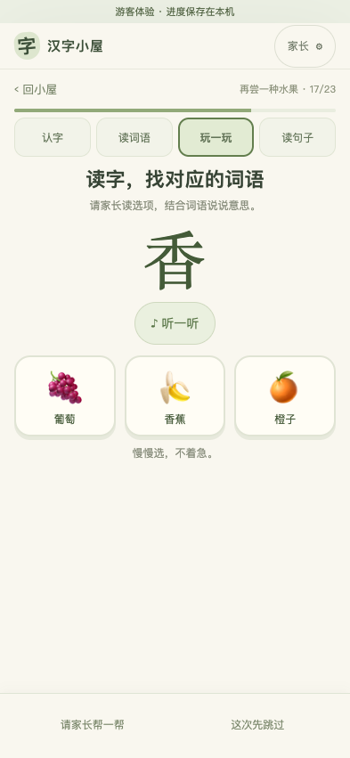
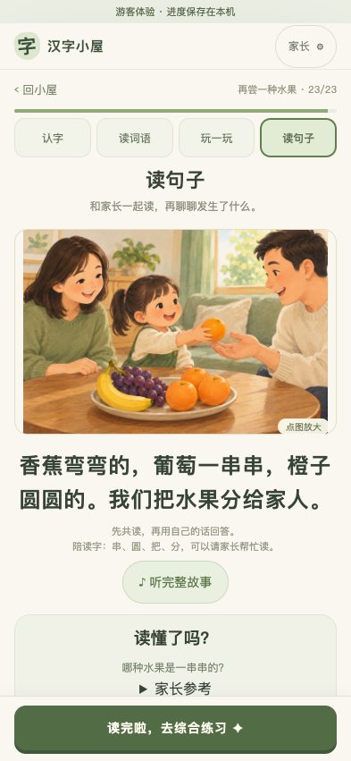
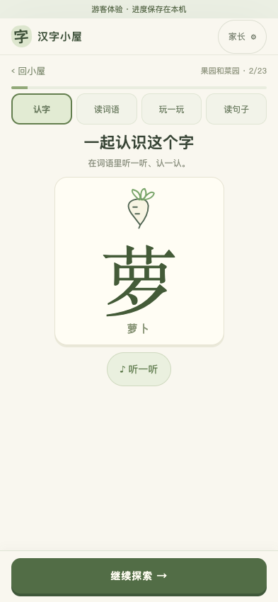
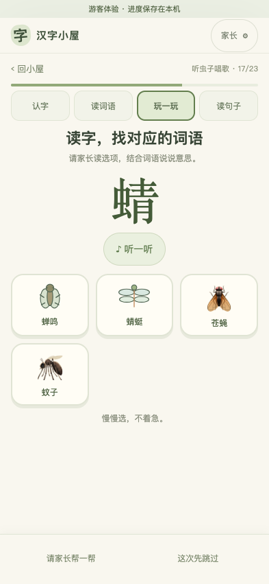
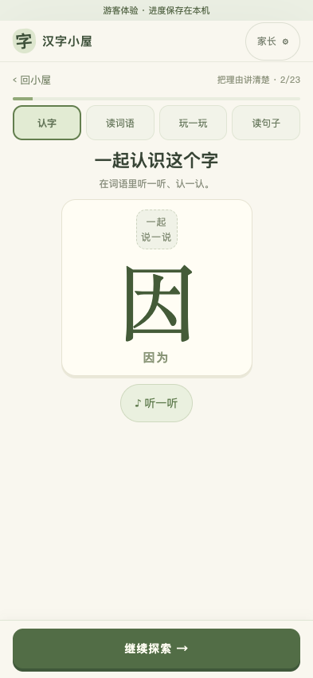

# 词语图标匹配优化

[打开可搜索的素材总览](素材总览.html) · [完整映射清单](词语素材清单.json) · [改动前的验收画面](../2026-09-23/课程验收报告.md)

本轮解决“按单字或大类套图标”造成的配图错配。当前本地课程依旧为 `curriculum-1000-v1`，通过客户端展示更新生效，不改变学习记录和历史题目。

## 改了什么

- 按完整词语匹配。香蕉、葡萄、橙子不再共用餐盘；牛、羊、马、猪、鸡不再共用脚印；红、黄、蓝、绿展示对应色块。
- 缺少合适系统图标的具体物品补原创简笔画，例如萝卜、红枣、葱花、蜻蜓、蝉、橡皮、胶水和粽子。简笔画随网页一同加载，不依赖外部图片网站。
- 认字、读词、辨义和当前版本的共读词卡共享配图。共读词卡合并“香蕉／香蕉、葡萄／葡萄”等重复词语；词语下方仍保留文字，帮助亲子共读。
- 无恰当配图的词语显示中性的“一起说一说”，不再用主题图标冒充词义。此提示不是该词的插图；抽象词、关系和复杂动作仍需语境教学。

## 覆盖与边界

200 个设计单元共有 934 个去重词语：266 个使用系统图标、222 个使用原创简笔画、10 个使用计数图、7 个使用符号、6 个使用色块，共 511 个有图示；其余 423 个保留陪读提示。该统计针对设计稿词语，原十课的少量例词差异与已有专用配图另行保留。

系统图标在不同手机上外观可能不同；简笔画是辅助提示，不等同于专业情境插画。此次没有把共读词卡改造成故事场景画，也没有宣称全套词语都已有独立释义图。

## 改动前后

原水果选项：

更新后的水果选项：

更新后的共读词卡（重复词语已合并）：

没有合适图标时使用简笔画：

抽象词保留陪读提示：

以上是本地应用实际操作截图。素材总览是从同一组件生成的独立样张，两者用途分别标明。

## 检查结果

生产镜像构建成功，单元测试 **54/54** 通过。12 个不同浏览器场景通过；最终部署后另复测 4 个配图流程通过；保存 16 张应用截图。

覆盖：旧十课完整学习与书架、家长切课与记录、204 课内容包和媒体、五字课、最终单元、320 像素窄屏及四类配图从认字到共读的完整流程。素材清单检查验证每个简笔画引用存在；不把同类图标、子串匹配误认为词义。没有修改真实孩子记录。

详细结果见 [浏览器验收结果](浏览器验收结果.json)。

## 维护

匹配表与简笔画说明见 [素材维护规则](../../apps/web/src/visuals/README.md)。可搜索总览由 `scripts/acceptance/visual-catalog.ts` 生成，后续新增素材可重跑。早期生成包里的原始图标字段和媒体保留不变，查看 API 原文仍会看到旧图标；当前学习界面使用词语匹配层。后续新内容发布需把审定素材纳入新包。
