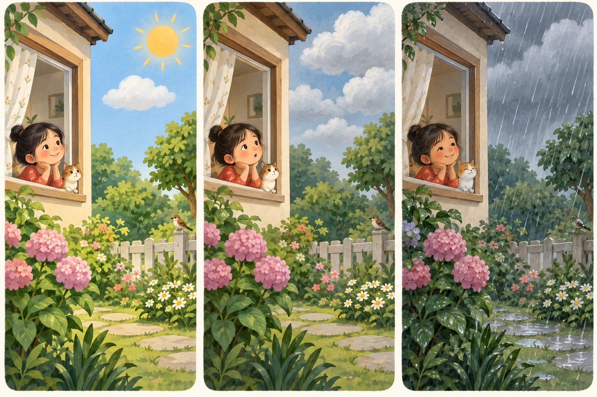
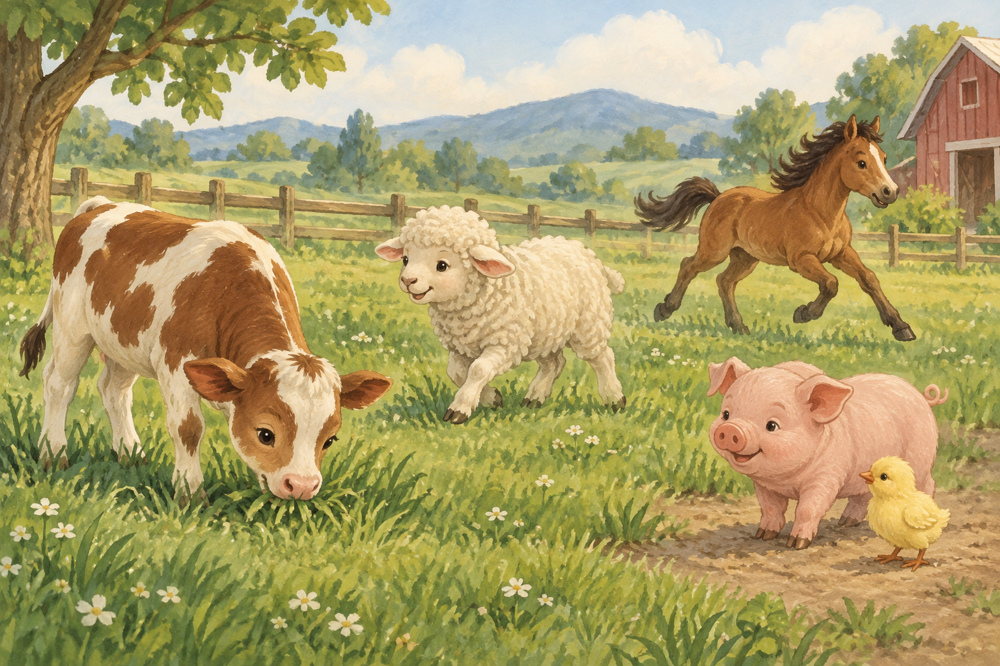
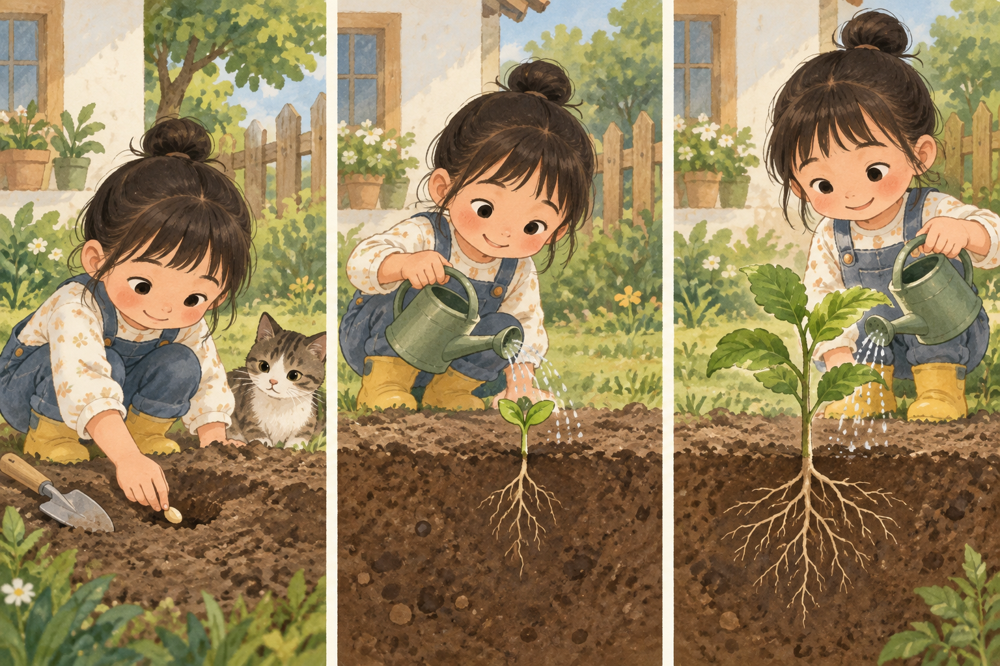
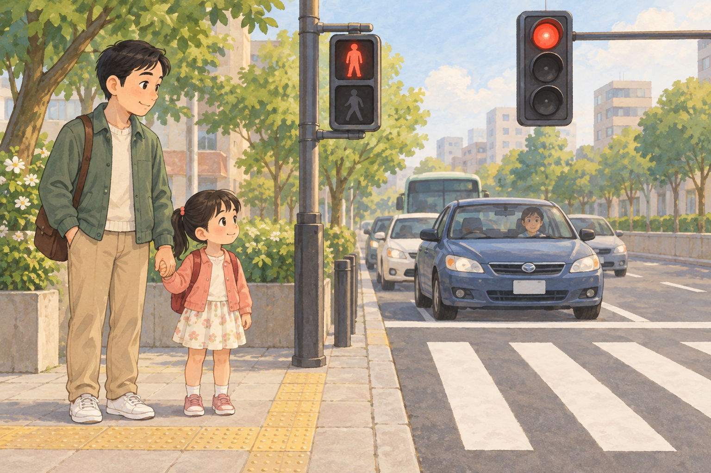
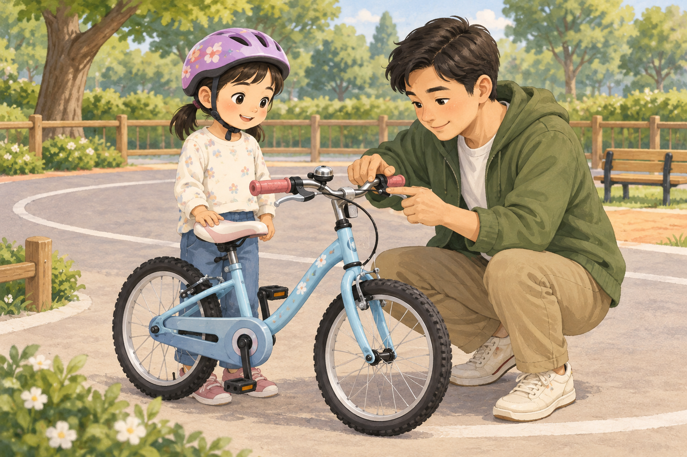
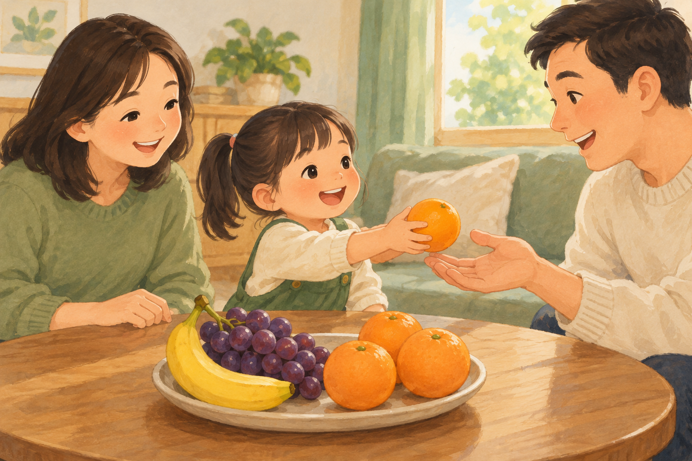
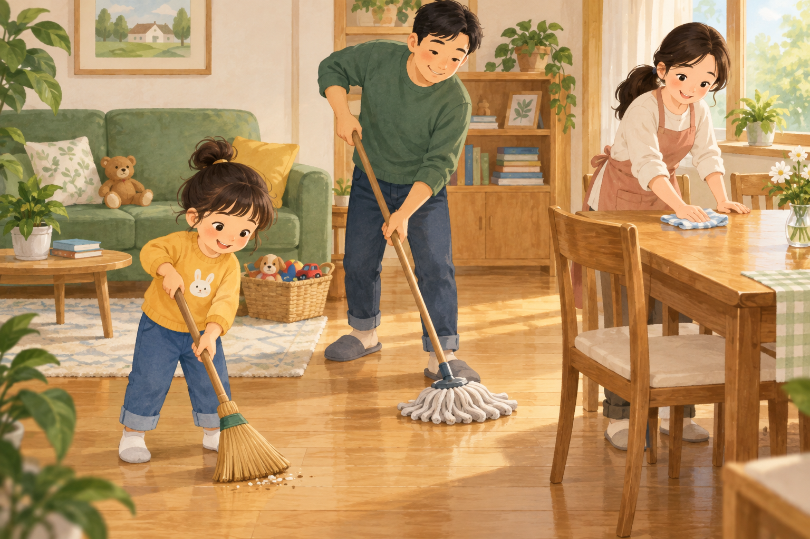
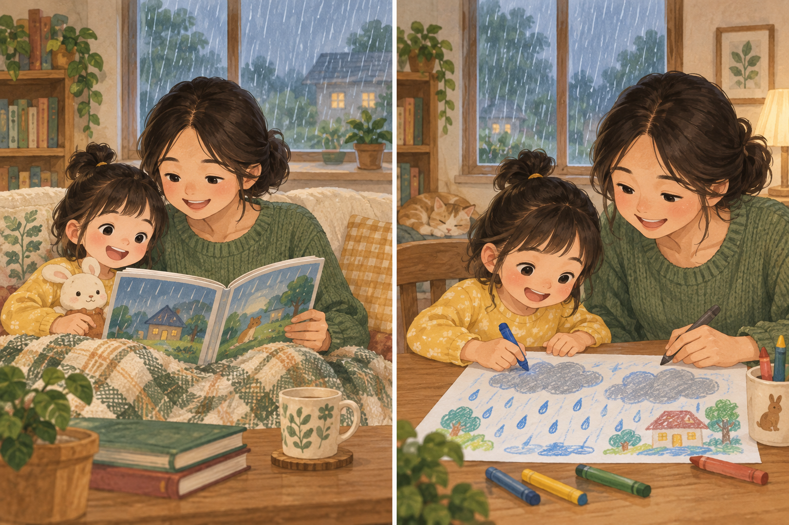

# 首批十课故事配图

首批 10 课；10 张故事插图、20 张实际页面截图。 10/10 浏览器流程通过。

[打开图文画廊](index.html)

采用内置 image_gen，逐课根据原文生成。下列原图为生成插图；手机图与放大图为 Playwright 操作本地应用的实拍，未使用真实孩子档案。

这十课从不同场景中选取，并非课程顺序的前十课。故事正文与历史学习记录保持原样。

## C012 · 太阳出来了

原文：太阳出来了，天上有白云。一会儿云变多，下起了雨。

画面检查：三格按晴天、云变多、下雨排列，表现天气变化。

[查看手机截图](截图/c012-phone.png) · [查看放大截图](截图/c012-large.png)

## C041 · 认识农场动物

原文：农场里，小牛吃草，小羊走来，小马跑过，小猪旁边有小鸡。

画面检查：牛吃草、羊走来、马跑过，猪旁有小鸡；五种动物分别可辨。

[查看手机截图](截图/c041-phone.png) · [查看放大截图](截图/c041-large.png)

## C050 · 种下一粒种子

原文：我种下一粒种子。后来长出小芽和根，再长成有枝叶的小苗。

画面检查：播种、发芽、长成小苗三个阶段；根位于土层以下。

[查看手机截图](截图/c050-phone.png) · [查看放大截图](截图/c050-large.png)

## C062 · 过马路

原文：交通灯前，汽车停下来。我拉着大人的手，等可以通行再走。

画面检查：孩子牵着大人的手站在人行道等候，汽车停下，尚未开始过街。

[查看手机截图](截图/c062-phone.png) · [查看放大截图](截图/c062-large.png)

## C066 · 骑车戴头盔

原文：在安全的场地骑车，我先戴好头盔。大人帮我检查车铃和刹车。

画面检查：孩子戴好头盔，大人检查自行车铃与刹车。

[查看手机截图](截图/c066-phone.png) · [查看放大截图](截图/c066-large.png)

## C090 · 再尝一种水果

原文：香蕉弯弯的，葡萄一串串，橙子圆圆的。我们把水果分给家人。

画面检查：孩子把橙子递给家人，桌上是香蕉、成串葡萄和橙子。

[查看手机截图](截图/c090-phone.png) · [查看放大截图](截图/c090-large.png)

## C097 · 周末做家务

原文：我扫地，爸爸拖地，妈妈擦桌子。大家一起整理，屋里整齐了。

画面检查：孩子扫地、爸爸拖地、妈妈擦桌，三种动作不同。

[查看手机截图](截图/c097-phone.png) · [查看放大截图](截图/c097-large.png)

## C128 · 把理由讲清楚

原文：因为下雨，所以我们在屋里看书，而且一起画了一张雨天的图。

画面检查：两格都能看到窗外下雨；室内先共读，再一起画雨天。

[查看手机截图](截图/c128-phone.png) · [查看放大截图](截图/c128-large.png)

## C154 · 我的身体有边界

原文：别人想摸我的肩、碰我的身体或抱我，要先问。我不愿意，就可以说“不”。

画面检查：孩子举手表示拒绝，大人保持距离，没有擅自触碰。

[查看手机截图](截图/c154-phone.png) · [查看放大截图](截图/c154-large.png)

## C194 · 端午看龙舟

原文：端午节，我们听传统故事，看龙舟，和家人吃粽子。不同地方也有不同的过节方式。

画面检查：一家人在护栏内看龙舟，近处有用叶子包裹的粽子。

[查看手机截图](截图/c194-phone.png) · [查看放大截图](截图/c194-large.png)

## 制作与验证

原文、插图映射与批次提示词保存于 [briefs.json](../../apps/web/src/story-art/briefs.json)。C090 先行样图的实际提示词见 [首次生成记录](C090首次生成提示词.txt)。工作区原图位于 `apps/web/src/story-art/images/`。本轮使用内置 image_gen，没有使用 CLI/API 备用模式。

本地生产构建成功，56/56 单元测试通过，10/10 故事截图流程通过；另有 10/10 原流程回归通过（词语配图、读词共读、小屏），见 [回归摘要](原流程回归摘要.json)。本批只覆盖以上十课，其他课程保留原有素材。

附加检查：游客整页断网刷新会被既有账户确认页面拦住，本轮未修改账户离线逻辑。插图测试验证的是缓存命中和当前页面断网读取，不宣称游客整页离线刷新已通过。见 [检查记录](附加离线检查记录.json)。
