# 课程自动验收与画面记录

生成时间：2026-09-23T11:13:22。内容版本：`curriculum-1000-v1`。

**37 个场景通过，0 个未通过，0 个跳过；19 张截图。**

范围：204 课、1000 字；本地应用 `http://localhost:8080`。

[打开截图画廊](index.html) · [机器结果摘要](验收结果.json)

- 本轮通过 Playwright 操作当前本地已发布应用。图片为浏览器实拍，不是设计稿；手机尺寸由桌面 Chrome 模拟。
- 全量内容检查覆盖 204 课内容包及故事音频、图片；完整点击流程覆盖原十课与代表性五字课。不能把接口可用等同于逐课人工教学审校。
- 截图中的开放目录由家长入口操作；错题来自故意选错。网络异常通过拦截测试页请求模拟，未关闭真实服务。
- 仅使用独立浏览器访客记录与专用测试账号，未进入或修改用户真实孩子档案。截图不包含真实家长邮箱、密码或令牌。
- 机器朗读的读音自然度、长句难度、儿童实际理解效果仍需人工审听与试读。本次不替代真机触控、正式 HTTPS 或互联网部署验收。

## 发现的问题与建议

- 素材待优化：截图 08 中香蕉、葡萄、橙子的选项均使用餐盘图标，无法通过图像区分含义，仍依赖读词和家长陪读。建议优先替换为与词义对应、彼此可辨的图片。
- 共读素材待优化：截图 11 的配图是图文词卡，尚不是表现故事情节的场景插画。建议为代表性课文补充情境图，再进行儿童理解效果试读。
- 截图是当前视口的画面；共读和阶段复习长内容需要向下滚动，截图不代表全部正文。
- 稳定性待跟踪：首轮存在失败场景，单独重测结果见明细。重测通过不等于已定位或修复原因；本轮未修改应用代码。

## 关键场景截图

### 01-home · 首页：完整课程入口

首页可加载；测试环境为手机宽度，课程数量另由 API 全量校验。

操作方式：真实浏览器操作；视口 393×851。

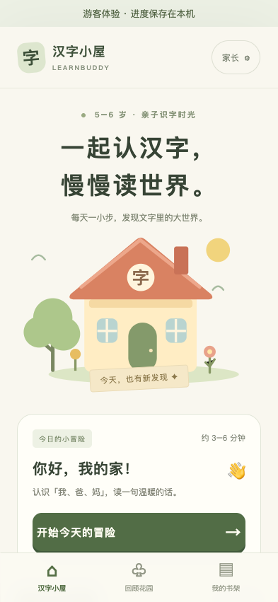

### 02-directory · 课程目录：20 个单元自动换行

通过家长入口开放目录后，整组课程可选；开放不会记为已学。

操作方式：真实家长入口操作；视口 393×851。

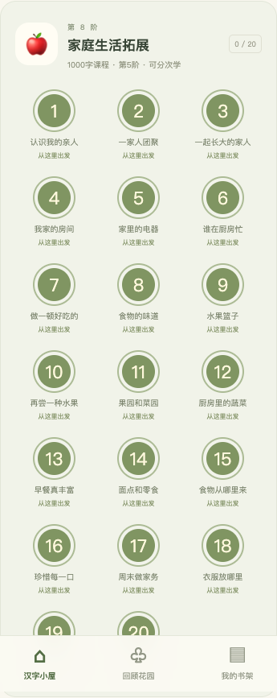

### 03-intro · 五字课开场：香蕉、葡萄、橙

课程含 5 字，明确提示可以分两次学习。

操作方式：真实浏览器操作；视口 393×851。

### 04-character · 认字：在“香蕉”里认识“香”

目标汉字、例词与继续按钮可见。

操作方式：真实浏览器操作；视口 393×851。

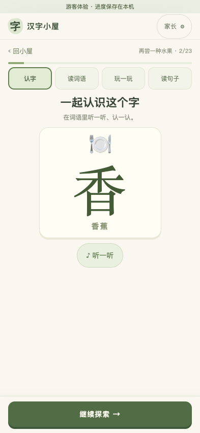

### 05-word · 读词语：完整词语与目标字对应

显示“香蕉”和目标字“香”，不把词语拆成无意义释义。

操作方式：真实浏览器操作；视口 393×851。

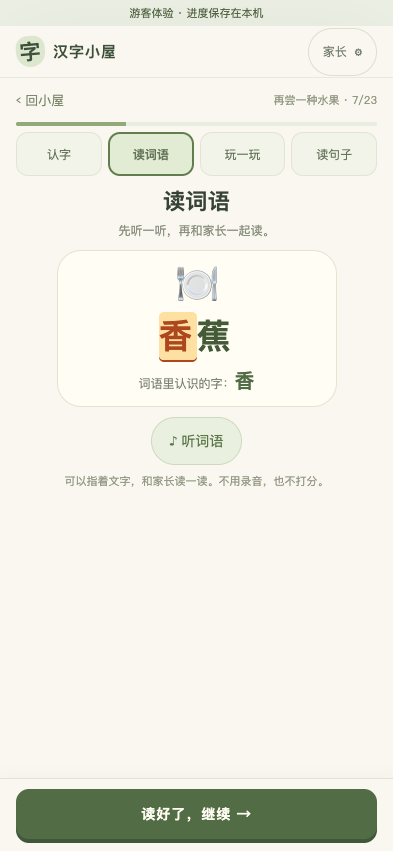

### 06-sound · 听词找字：同词字不互作干扰

“香”和“蕉”不会同时作为“香蕉”录音的两个候选答案。

操作方式：真实浏览器操作；视口 393×851。

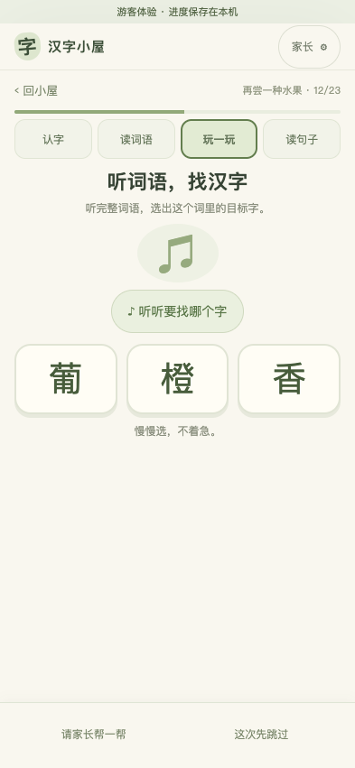

### 07-wrong · 答错反馈：支持继续尝试

故意选择错误答案，出现提示并允许继续，没有卡住流程。

操作方式：真实浏览器操作；视口 393×851。

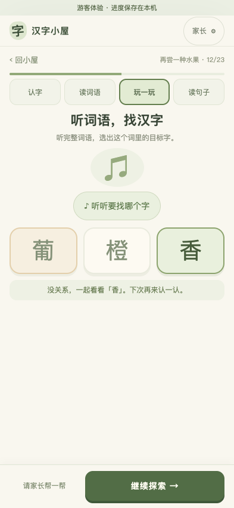

### 08-meaning · 词义联系：候选词不重复

同一题没有两个“香蕉”选项；词语与图标一同呈现，需要家长陪读选项。

操作方式：真实浏览器操作；视口 393×851。

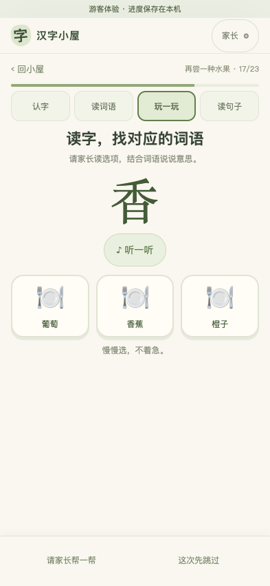

### 09-hunt · 找字：五个独立位置

五个目标字都有独立点击位置，计数从 0/5 开始。

操作方式：真实浏览器操作；视口 393×851。

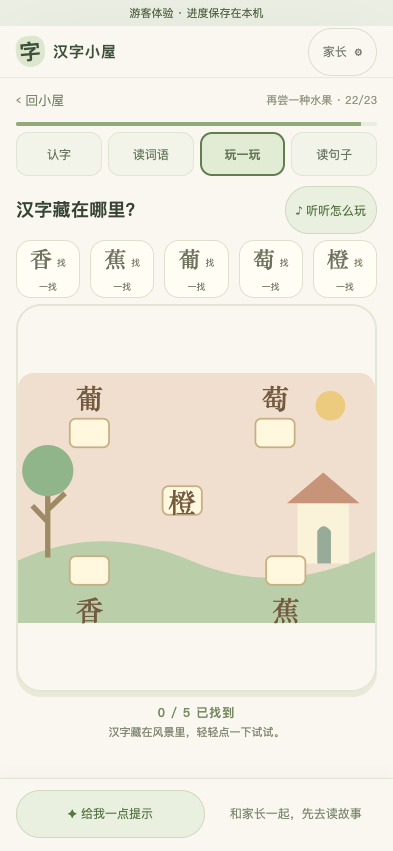

### 10-hunt-done · 找字完成：五字全部找到

计数为 5/5，并出现进入故事的按钮。

操作方式：真实浏览器操作；视口 393×851。

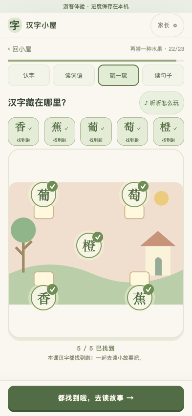

### 11-story · 共读与理解问答

正文、理解问题、家长参考和底部完成按钮可用；长内容在正文区域滚动。

操作方式：真实浏览器操作；视口 393×851。

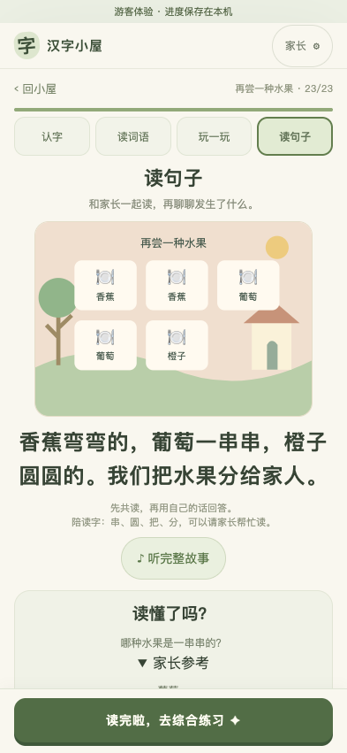

### 12-done · 完成页：综合练习入口

完成共读后可以进入新字与老朋友的综合练习。

操作方式：真实浏览器操作；视口 393×851。

### 13-comprehensive · 综合练习：本课两字＋历史错题一字

先在旧“认识家人”课故意答错“我”，再完成本课；得到 3 题队列，未通过篡改进度制造错题。

操作方式：真实浏览器操作；视口 393×851。

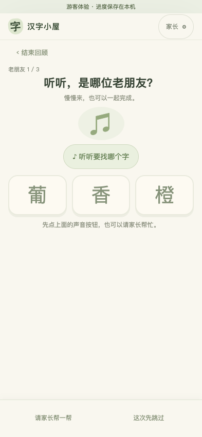

### 14-final-stage · 最后一课：主题复习和阶段共读

实际走到 C200 的共读环节，阶段材料可滚动阅读，课程没有中途缺页。

操作方式：真实浏览器操作；视口 393×851。

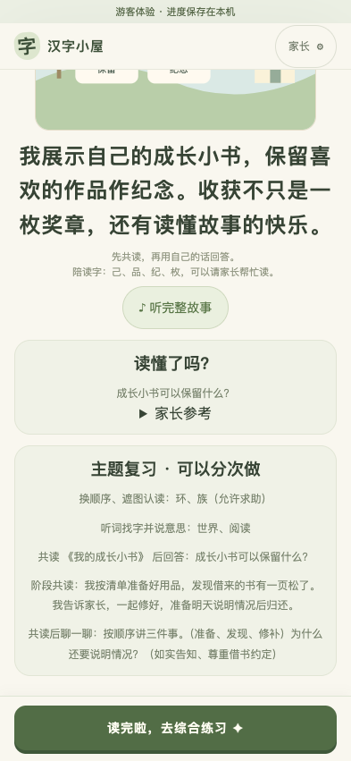

### 15-narrow · 320 像素小屏：长内容与操作区

没有横向溢出；长材料可滚动，完成按钮保持在屏幕内。

操作方式：真实浏览器操作；视口 320×568。

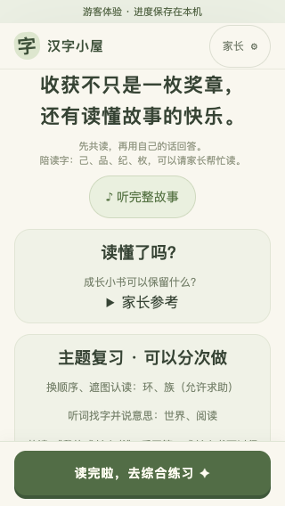

### 16-cloud · 云端学习：进度已确认

使用专用验收账号和新建测试孩子，未进入用户真实孩子档案。

操作方式：真实浏览器操作；视口 393×851。

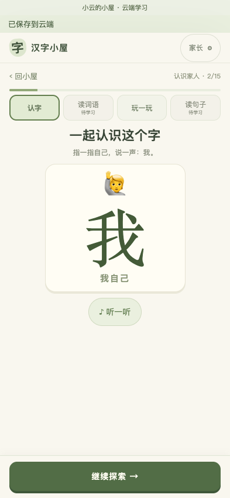

### 17-pending · 网络异常：明确提示本机待同步

主动阻断测试页的同步请求，操作保存在本机，页面没有显示成云端成功。

操作方式：Playwright 阻断同步接口，模拟网络失败；视口 393×851。

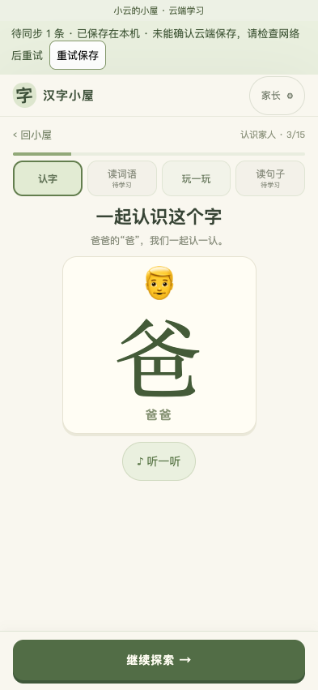

### 18-synced · 恢复网络：继续原位置

解除请求阻断并重试，待同步提示消失，继续同一课次。

操作方式：真实浏览器操作；视口 393×851。

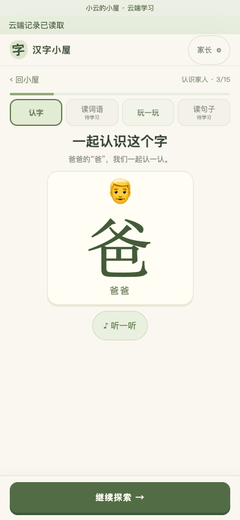

### 19-error · 课程加载失败：提供重试入口

阻断目录请求，错误页保留重试入口，不假装加载成功。

操作方式：Playwright 阻断目录接口，模拟服务失败；视口 393×851。

## 自动化结果明细

| 场景 | 最后结果 | 耗时 |
| --- | --- | --- |
| phone family flow: verify, isolate children and guest, persist login, reset password | passed | 16.4 秒 |
| account outage on reload preserves storage and offers a retry | passed | 2.5 秒 |
| admin editing, preview, publishing and rollback at phone width | passed | 2.4 秒 |
| admin access failure and save conflict preserve unsaved text | passed | 1.7 秒 |
| a family completes the lesson, resumes progress, reads and resets | passed | 6.4 秒 |
| audio failure and incorrect answers allow assisted completion | passed | 2.1 秒 |
| 320px layout fits and corrupted storage is preserved | passed | 1.9 秒 |
| hidden-character game fits a narrow screen and supports leaving early | passed | 2.4 秒 |
| all ten chapters unlock, teach the right characters, finish their hunts and open matching stories | passed | 31.7 秒 |
| parent access and switching keep independent lesson progress | passed | 4.1 秒 |
| cloud saves real answers, resumes on another device and preserves formal position during reading | passed | 18.4 秒 |
| lost advance response retries the same event without advancing twice; offline queues writes | passed | 4.2 秒 |
| home loads a catalog, lessons load on demand, media comes from API URLs | passed | 2.1 秒 |
| catalog outage preserves raw progress and retry restores the same word step | passed | 2.5 秒 |
| lesson failure offers retry and does not fall back to bundled content | passed | 2.1 秒 |
| legacy storage is backed up and API text is rendered without a frontend rebuild | passed | 3.4 秒 |
| loaded lesson survives API loss and missing illustration permits assisted reading | passed | 1.8 秒 |
| complete published catalog and every lesson package resolve their media | passed | 19.8 秒 |
| five-character compound-word lesson completes without ambiguous options or overlapping hunt targets | passed | 6.3 秒 |
| last curriculum unit, stage review and the full mobile directory render | passed | 1.7 秒 |
| export includes factual answers and unsent device records; child deletion preserves sibling and guest | passed | 4.2 秒 |
| offline device purges deleted child and unsent queue on reconnect without deleting sibling | passed（此前失败，已重测） | 12.5 秒 |
| account deletion revokes other devices and cleanup proof clears unsent local data after reconnect | passed | 8.8 秒 |
| offline answer survives reload, synchronizes actual choices once and leaves no phantom cloud save | passed | 10.1 秒 |
| other-device conflict preserves local facts and requires explicit server-position choice | passed | 11.4 秒 |
| parent previews and imports guest history without deleting it or counting new answers | passed | 8.8 秒 |
| failed IndexedDB write does not advance or falsely report a queued save | passed | 4.8 秒 |
| unsent records stay with the original account across sign-out and another family login | passed | 66.9 秒 |
| words and stories highlight progressively, finish and restart | passed | 12.4 秒 |
| legacy story progress can reopen words and return without modifying learning evidence | passed | 5.6 秒 |
| unreached reading stages cannot be opened by guessing a URL | passed | 2.7 秒 |
| lesson actions stay onscreen with browser toolbars (393x650) | passed | 24.5 秒 |
| lesson actions stay onscreen with browser toolbars (320x568) | passed | 23.5 秒 |
| legacy stories fit and expanded stage stories remain readable on compact screens | passed | 47.3 秒 |
| 截图验收：目录、旧课与五字课、历史错题综合练习、最后一课 | passed | 26.3 秒 |
| 截图验收：云端档案、断网记录和恢复同步 | passed | 51.4 秒 |
| 截图验收：课程服务失败与重试恢复 | passed | 7.1 秒 |

## 复验方式

见 [验收脚本说明](../../scripts/acceptance/README.md)。文档图片保存在同级 `截图/`，不会被 Playwright 清理临时输出时删除。
